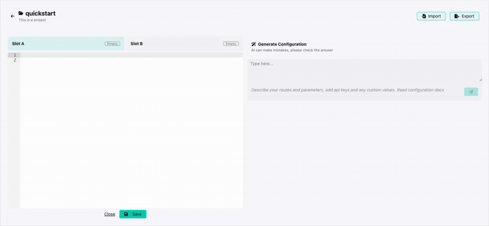
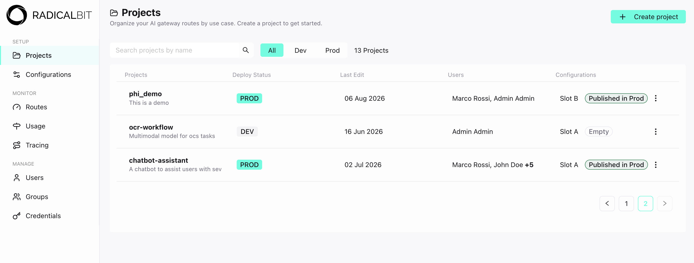
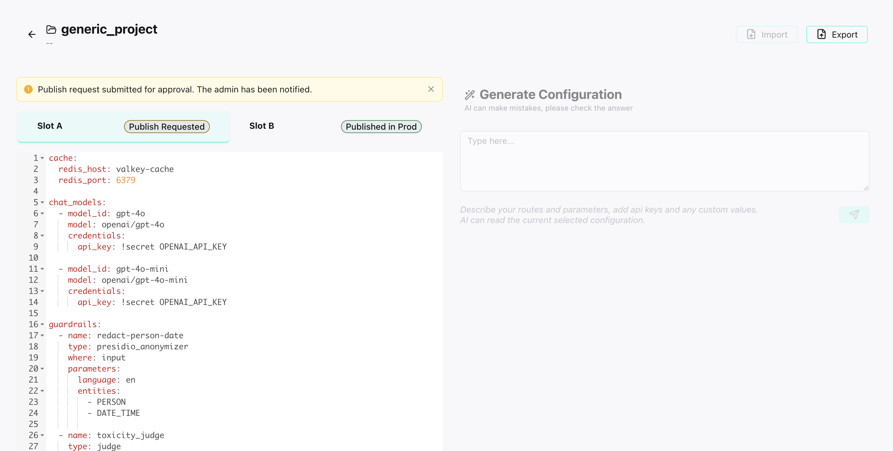
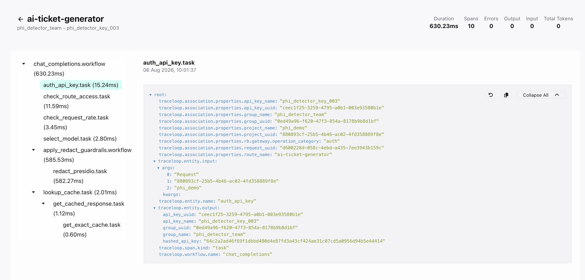

<div align="center">


# Radicalbit AI Gateway

**Describe it. Generate it. Serve it.**


A configurable LLM proxy with guardrails, rate limiting, multi-strategy routing, semantic caching, and end-to-end request tracing.
Everything is managed through a UI — and an AI assistant that generates the configuration from plain English.


[](LICENSE)
[](https://github.com/radicalbit/radicalbit-ai-gateway/releases)
[](https://docs.ai-gateway.radicalbit.ai/)

[**Docs**](https://docs.ai-gateway.radicalbit.ai/) ·
[**Quickstart**](#quickstart) ·
[**Examples**](https://docs.ai-gateway.radicalbit.ai/getting-started/examples) ·
[**Enterprise**](#enterprise)

</div>

---

<div align="center">

<!-- TODO: Replace with hero GIF — show: AI-generated config in the UI → Serve button → curl call in terminal -->


</div>

### Observability
- **Prometheus metrics** — 20+ metrics (request rates, latency, token usage, cache hits, guardrail triggers, fallback activations) on a dedicated endpoint
- **OpenTelemetry tracing** — end-to-end distributed tracing with ClickHouse storage and support for custom OTLP exporters (Jaeger, Grafana Tempo, etc.)
- **Alert Rules** — real-time email notifications triggered by guardrails, caching, and route events
- **UI dashboard** — manage routes, groups, API keys, alert rules, and monitor cost and events in real time
*From your needs to a live API call, under 60 seconds.*

---

## Why this gateway

- **Configure in plain English** — Describe a route, get valid YAML. No schema to learn, no docs to tab through.
- **Cost control is a routing decision** — Route by token count, time of day, or budget ratio. Add semantic caching. The model spend problem is a configuration problem.
- **Guardrails in the config, not in the code** — PII detection, prompt injection checks, LLM-as-a-Judge — enforced at the gateway layer before anything reaches the model.
- **Full visibility per request** — Routing decision, cache hit/miss, guardrail results, upstream latency. Every call, no sampling.

---

## Quickstart

For this example, you need Docker, Docker Compose, and an OpenAI API key.

The gateway is provider-agnostic. The examples below use one provider for illustration — swap in any supported provider without changing anything else.

**Step 1 — Clone and add your credentials**

```bash
git clone https://github.com/radicalbit/radicalbit-ai-gateway
cd radicalbit-ai-gateway
```

Create a `secrets.yaml` file in the project root:

```yaml
# secrets.yaml — add the API key for whichever provider you use
OPENAI_API_KEY: sk-your-key-here
```

**Step 2 — Start the gateway**

```bash
GATEWAY_TAG=latest docker compose up -d
```

Once services are healthy (20–30 seconds), the gateway is running at **http://localhost:9000**.

**Step 3 — Configure in the UI**

Open **[http://localhost:9000](http://localhost:9000)** and:

1. **Create a project** — give it a name, e.g. `quickstart`
2. **Add a configuration** — paste the snippet below in the editor, or click **Generate** and describe what you want in plain English:

```yaml
chat_models:
  - model_id: gpt-4o-mini
    model: openai/gpt-4o-mini
    credentials:
      api_key: !secret OPENAI_API_KEY

routes:
  my-assistant:
    chat_models:
      - gpt-4o-mini
```

3. **Load → Approve → Serve** the configuration
4. **Create a group and an API key**, then associate the key with the `my-assistant` route — this is required to authenticate requests

**Step 4 — Call your route**

```bash
curl http://localhost:9000/v1/chat/completions \
  -H "Authorization: Bearer YOUR_API_KEY" \
  -H "Content-Type: application/json" \
  -d '{
    "model": "quickstart/my-assistant",
    "messages": [{"role": "user", "content": "Hello!"}]
  }'
```

The gateway returns a standard OpenAI-format response regardless of the underlying provider.

**Step 5 — Inspect the call in the UI**

Go back to **[http://localhost:9000](http://localhost:9000)** and explore what was recorded:

- **Usage dashboard** — token consumption and cost for the call, broken down by route and group
- **Tracing** — the full request trace: routing decision, latency per span, and the exact content of the request and response

**Go further — add a guardrail in plain English**

Back in the configuration editor, click **Generate** and try this prompt:

> *"Add a guardrail to the my-assistant route that blocks any input containing PII — email addresses, phone numbers, and credit card numbers."*

The AI assistant will update the YAML for you. Load → Approve → Serve, then retry the curl with a message containing an email address and watch it get blocked.

---

## Three ways to configure

All three paths produce the same YAML — pick the one that fits your workflow.

### 1. Radicalbit Skills — from your IDE

The [Radicalbit Skills](https://github.com/radicalbit/radicalbit-skills) plugin for
Claude Code generates a complete `config.yaml` from a natural language prompt,
directly inside your editor. Install it from the Claude Code Marketplace, then invoke:

```
/radicalbit-ai-gateway:ai-gateway-config
```

Describe what you need:

> *"Create a route called `customer-support` that uses GPT-4o for complex queries
> and GPT-4o mini for short ones, with a 500-token threshold. Block any input
> containing PII."*

The skill writes a valid, ready-to-serve `config.yaml` to your project.

### 2. AI assistant in the UI — from the browser

Enable the AI config generator with one environment variable before starting the gateway:

```bash
CONFIG_GENERATOR_OPENAI_API_KEY=sk-your-key-here
```

A **Generate** button appears in the project configuration editor. Use the same
prompt as above and the assistant produces this YAML inline:

```yaml
chat_models:
  - model_id: gpt-4o
    model: openai/gpt-4o
    credentials:
      api_key: !secret OPENAI_API_KEY

  - model_id: gpt-4o-mini
    model: openai/gpt-4o-mini
    credentials:
      api_key: !secret OPENAI_API_KEY

guardrails:
  - name: block_pii
    type: presidio_analyzer
    where: input
    behavior: block
    parameters:
      language: en
      entities:
        - EMAIL_ADDRESS
        - CREDIT_CARD
        - PHONE_NUMBER

routing:
  - name: token-split
    type: deterministic
    rule: token_length
    default_model_id: gpt-4o
    output_mapping:
      - model_id: gpt-4o-mini
        conditions:
          lte: 500

routes:
  customer-support:
    chat_models:
      - gpt-4o
      - gpt-4o-mini
    routing: token-split
    guardrails:
      - block_pii
```

Review before serving — AI output should be validated before going to production.

### 3. Hand-written YAML

Prefer full control? Write the configuration directly. The schema is the same
regardless of which path generated it.

Full configuration reference: [docs.ai-gateway.radicalbit.ai/configuration/basic-setup](https://docs.ai-gateway.radicalbit.ai/configuration/basic-setup)

---

## Features

| Category | Feature | Description |
|---|---|---|
| 🔀 **Routing** | Keyword | Route by keyword match in the message |
| | Token length | Route by token count of the last message |
| | Context length | Route by total conversation token count |
| | Time | Route by time of day using cron expressions |
| | Budget | Switch to cheaper models as spend increases |
| | Text classification | Delegate routing to an external ML model via HTTP |
| | LLM-based | Use an LLM to classify request intent and select the target model |
| | Semantic | Embedding similarity against intent examples |
| 🛡️ **Guardrails** | Pattern matching | `contains`, `starts_with`, `ends_with`, `regex` |
| | PII detection | Detect PII in requests via Microsoft Presidio |
| | PII redaction | Mask PII in responses before returning to the client |
| | LLM judge | Use an LLM to evaluate requests or responses against any custom logic — define your own criteria via prompt templates |
| ⚡ **Caching** | Exact cache | Return stored responses for identical requests |
| | Semantic cache | Match similar requests by embedding similarity |
| 🚦 **Limits** | Rate limiting | Cap requests per time window per route (HTTP 429 on breach) |
| | Token limiting | Cap token usage per time window per route |
| | Budget limiting | Cap spend per time window per route |
| 🔄 **Reliability** | Model fallback | Automatic failover across models and providers |
| 📊 **Observability** | Usage dashboard | Costs and token volume by route and group |
| | Request tracing | Routing decision, cache hit/miss, guardrail results, latency per span |
| | Telemetry | OpenTelemetry export to Jaeger or any OTLP collector |
| 🔌 **Providers** | Native | OpenAI, Anthropic, Google Gemini, DeepSeek, Mistral, Azure OpenAI |
| | Compatible | Any OpenAI-format endpoint: Ollama, vLLM, OpenRouter, on-premises |

<details>
<summary>Routing example — semantic routing</summary>

```yaml
routing:
  - name: intent-router
    type: semantic
    embedding_model_id: text-embedding-3-small
    similarity_threshold: 0.35
    default_model_id: gpt-4o-mini
    output_mapping:
      - model_id: code-assistant
        conditions:
          - "write a python function"
          - "debug this code"
      - model_id: support-model
        conditions:
          - "I can't log in"
          - "my subscription isn't working"
```

Full routing reference: [docs.ai-gateway.radicalbit.ai/features/advanced-routing](https://docs.ai-gateway.radicalbit.ai/features/advanced-routing)

</details>

<details>
<summary>Guardrails example — PII detection + LLM judge</summary>

```yaml
guardrails:
  - name: pii_check
    type: presidio_analyzer
    where: input
    behavior: block
    parameters:
      language: en
      entities: [EMAIL_ADDRESS, CREDIT_CARD, PHONE_NUMBER]

  - name: pii_redact
    type: presidio_anonymizer
    where: output
    parameters:
      language: en
      entities: [PERSON, PHONE_NUMBER]

  - name: injection_guard
    type: judge
    where: input
    behavior: block
    parameters:
      prompt_ref: "prompt_injection_check.md"
      model_id: gpt-4o-mini
```

Full guardrail reference: [docs.ai-gateway.radicalbit.ai/features/guardrails](https://docs.ai-gateway.radicalbit.ai/features/guardrails)

</details>

<details>
<summary>Caching example — semantic cache</summary>

```yaml
routes:
  my-assistant:
    chat_models:
      - gpt-4o-mini
    embedding_models:
      - text-embedding-3-small
    caching:
      type: semantic
      ttl: 3600
      embedding_model_id: text-embedding-3-small
      similarity_threshold: 0.85
      distance_metric: cosine
      dim: 1536
```

Full caching reference: [docs.ai-gateway.radicalbit.ai/features/caching](https://docs.ai-gateway.radicalbit.ai/features/caching)

</details>

<details>
<summary>Routing example — deterministic strategies (keyword, token length, time, budget)</summary>

**Keyword — route by topic word in the message**

```yaml
routing:
  - name: complexity-split
    type: deterministic
    rule: keyword
    default_model_id: gpt-4o-mini
    output_mapping:
      - model_id: gpt-4o
        conditions:
          - "urgent"
          - "complex"
          - "analysis"
```

**Token length — cheap model for short queries**

```yaml
routing:
  - name: token-split
    type: deterministic
    rule: token_length
    default_model_id: gpt-4o
    output_mapping:
      - model_id: gpt-4o-mini
        conditions:
          lte: 500
```

**Time — switch models by time of day**

```yaml
routing:
  - name: business-hours
    type: deterministic
    rule: time
    default_model_id: gpt-4o-mini
    output_mapping:
      - model_id: gpt-4o
        conditions:
          - "0 9-17 * * 1-5"    # Mon–Fri, 09:00–17:00 UTC
```

**Budget — degrade gracefully as spend approaches limit**

```yaml
routing:
  - name: budget-aware
    type: deterministic
    rule: budget
    default_model_id: gpt-4o
    output_mapping:
      - model_id: gpt-4o-mini
        conditions:
          threshold: 0.8        # switch when 80% of budget is consumed
```

</details>

<details>
<summary>Routing example — text classification (external ML model)</summary>

```yaml
routing:
  - name: sentiment-router
    type: text_classification
    url: http://your-classifier:8888
    timeout: 3.0
    default_model_id: fallback-model
    output_mapping:
      - model_id: positive-handler
        conditions:
          - "POSITIVE"
      - model_id: escalation-handler
        conditions:
          - "NEGATIVE"
```

</details>

<details>
<summary>Guardrails example — pattern matching (contains, regex)</summary>

```yaml
guardrails:
  - name: profanity_check
    type: contains
    where: input
    behavior: block
    parameters:
      values:
        - "inappropriate"
        - "offensive"

  - name: no_greeting_required
    type: starts_with
    where: input
    behavior: warn
    parameters:
      values:
        - "Hello"
        - "Hi"

  - name: email_detection
    type: regex
    where: input
    behavior: warn
    parameters:
      pattern: '\b[A-Za-z0-9._%+-]+@[A-Za-z0-9.-]+\.[A-Z|a-z]{2,}\b'
```

</details>

<details>
<summary>Caching example — exact cache</summary>

```yaml
routes:
  my-assistant:
    chat_models:
      - gpt-4o-mini
    caching:
      type: exact
      ttl: 3600
```

</details>

<details>
<summary>Limits example — rate limiting, token limiting, budget limiting</summary>

```yaml
routes:
  production:
    chat_models:
      - gpt-4o
    rate_limiting:
      algorithm: fixed_window
      window_size: 1 minute
      max_requests: 100
    token_limiting:
      algorithm: fixed_window
      window_size: 1 hour
      max_tokens: 100000
    budget_limiting:
      window_size: 1 month
      max_budget: 50.0
```

All three limits are independent and can be combined freely on the same route.

</details>

<details>
<summary>Reliability example — model fallback</summary>

```yaml
chat_models:
  - model_id: gpt-4o
    model: openai/gpt-4o
    credentials:
      api_key: !secret OPENAI_API_KEY

  - model_id: gpt-4o-mini
    model: openai/gpt-4o-mini
    credentials:
      api_key: !secret OPENAI_API_KEY

  - model_id: claude-3-sonnet
    model: anthropic/claude-3-sonnet
    credentials:
      api_key: !secret ANTHROPIC_API_KEY

routes:
  production:
    chat_models:
      - gpt-4o
      - gpt-4o-mini
      - claude-3-sonnet
    fallback:
      - target: gpt-4o
        fallbacks:
          - gpt-4o-mini
          - claude-3-sonnet
```

Fallbacks work across providers — mixing models from different vendors in the same chain is valid.

</details>

---

## UI tour

The gateway ships with a built-in UI. It is the control plane for everything administrative — managing projects, configuring routes, creating groups and API keys — and the observability layer for understanding what is happening at runtime.

<!-- TODO: Replace placeholders with dark-mode screenshots from Federico -->

**Projects** — create isolated environments for each application or team, each with its own routes, models, and configuration lifecycle.



**Configuration editor** — write YAML by hand or describe what you need and let the AI assistant generate it. Load, approve, and serve without leaving the browser.



**Usage dashboard** — track token consumption and cost by route and group. Understand where your LLM budget is going before it becomes a problem.


**Tracing** — inspect any request end-to-end: which model answered, how the request was routed, whether the cache was hit, what guardrails evaluated, and the latency of every span.



---

## Enterprise

The open-source edition contains everything you need to run the gateway in production. Enterprise adds the governance layer:

- **RBAC** — three built-in roles (Admin, Builder, Auditor)
- **SSO** — OIDC and Keycloak / IDP integration
- **Audit logging** — SOC 2 / ISO 27001 / DORA compliance
- **Cloud secret management** — HashiCorp Vault, AWS Secrets Manager, GCP Secret Manager, Azure Key Vault

[Learn more about Enterprise →](https://docs.ai-gateway.radicalbit.ai/reference/enterprise)

<div align="center">
  <a href="https://radicalbit.ai/book-a-demo-radicalbit/">
    
  </a>
</div>

---

## Community and contributing

**Documentation** — [docs.ai-gateway.radicalbit.ai](https://docs.ai-gateway.radicalbit.ai/)

<!-- VERIFY: Add a Discord or community Slack link here if a public server exists -->

**Contributing** — Bug reports, feature requests, and pull requests are welcome on
GitHub. For substantial changes, open an issue first to align on approach.


**Repository history** — This gateway started as an internal project at Radicalbit
and is now open source. The commit history reflects the moment we made the transition,
not the years of development behind it.

**License** — Apache License 2.0. See [LICENSE](LICENSE) for terms.

**Sponsored by [Radicalbit](https://radicalbit.ai)**
