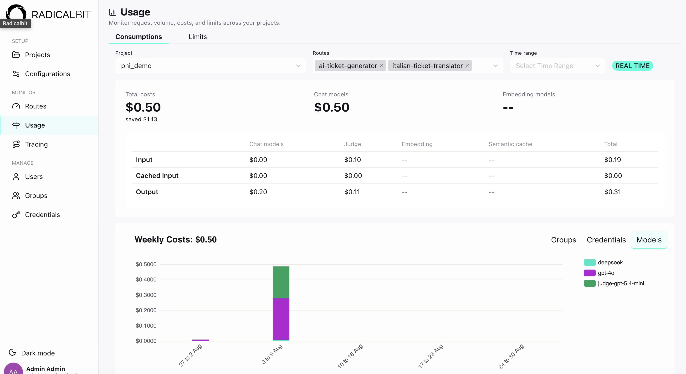

<div align="center">


# Radicalbit AI Gateway

**Describe it. Generate it. Serve it.**

An LLM proxy with guardrails, rate limiting, multi-strategy routing, semantic caching, MCP proxy and end-to-end request tracing. Everything is configured through a UI, including an AI assistant that writes the YAML from a plain English description.


[](LICENSE)
[](https://github.com/radicalbit/radicalbit-ai-gateway/releases)
[](https://docs.ai-gateway.radicalbit.ai/)

[**Docs**](https://docs.ai-gateway.radicalbit.ai/) ·
[**Quickstart**](#quickstart) ·
[**Features**](#features) ·
[**Examples**](https://docs.ai-gateway.radicalbit.ai/getting-started/examples) ·
[**Enterprise**](#enterprise)

</div>

---

<div align="center">

<!-- TODO: Replace with hero GIF - show: AI-generated config in the UI, Serve button, curl call in terminal -->


*Generating a configuration from a prompt, serving it, and calling the route.*

</div>

---

## Why this gateway

- **Configure in plain English.** Describe a route, get valid YAML. There is no schema to learn and no documentation to tab through.
- **Cost control is part of the configuration.** Route by token count, time of day, or budget consumed, and add semantic caching on top. Your application code does not change.
- **Guardrails at the gateway, not in your code.** PII detection, prompt injection checks, and LLM-as-a-judge run before the request reaches the model.
- **Full visibility per request.** Routing decision, cache hit or miss, guardrail results, and upstream latency, on every call. No sampling.

---

## Quickstart

You need Docker, Docker Compose, and an API key for at least one model provider.

The gateway is provider-agnostic. The example below uses OpenAI for illustration. Swapping in another supported provider changes nothing else.

### 1. Clone the repository

```bash
git clone git@github.com:radicalbit/radicalbit-ai-gateway.git
cd radicalbit-ai-gateway
```

### 2. Add your provider credentials

Create a `secrets.yaml` file in the project root. These are the keys the gateway uses to call your models:

```yaml
# secrets.yaml
OPENAI_API_KEY: sk-your-key-here
```

The AI config generator uses a **separate** key, set in `CONFIG_GENERATOR_OPENAI_API_KEY` inside `docker-compose.yaml`. It ships with an invalid placeholder (`sk-123`), so replace it before starting the gateway if you want the **Generate** button to work. This key never transits through your routes, and the generator call is billed to it rather than to your gateway traffic. If you leave the placeholder in place, everything else still works and you write the YAML yourself.

### 3. Start the gateway

```bash
GATEWAY_TAG=latest docker compose up -d
```

Services take 20 to 30 seconds to become healthy. The gateway then runs at **http://localhost:9000**.

### 4. Configure it in the UI

Open **[http://localhost:9000](http://localhost:9000)** and:

1. **Create a project** and name it `quickstart`.
2. **Add a configuration.** Paste the snippet below into the editor, or click **Generate** and describe what you want in plain English.

   ```yaml
   chat_models:
     - model_id: gpt-4o-mini
       model: openai/gpt-4o-mini
       credentials:
         api_key: !secret OPENAI_API_KEY

   routes:
     my-assistant:
       chat_models:
         - gpt-4o-mini
   ```

3. **Save**, then **Approve**, then **Publish** the configuration. Routes only go live once a configuration is published.
4. **Create an API key** on the **Credentials** page. Copy it and store it somewhere safe, because it is not shown again.
5. **Create a group** on the **Groups** page, then open it and associate it with the `quickstart/my-assistant` route and with the API key you just created.

You are all set up!

### 5. Call your route
Open a terminal and send this cURL:

```bash
curl http://localhost:9000/v1/chat/completions \
  -H "Authorization: Bearer YOUR_API_KEY" \
  -H "Content-Type: application/json" \
  -d '{
    "model": "quickstart/my-assistant",
    "messages": [{"role": "user", "content": "Hello!"}]
  }'
```

The response comes back in standard OpenAI format whichever provider served it, so existing OpenAI SDK clients work by changing the base URL.

### 6. Inspect the call

Back in the UI:

- **Usage** shows token consumption and cost for the call, broken down by route and group.
- **Tracing** shows the full request trace: routing decision, latency per span, and the exact request and response payloads.

### Next: add a guardrail in plain English

In the configuration editor, click **Generate** and try:

> *"Add a guardrail to the my-assistant route that blocks any input containing PII: email addresses, phone numbers, and credit card numbers."*

The assistant updates the YAML. Save, approve, and serve it, then repeat the curl with an email address in the message and watch the request get blocked.

---

## Three ways to configure

All three paths produce the same YAML. Pick whichever fits your workflow.

### 1. Radicalbit Skills, from your IDE

The [Radicalbit Skills](https://github.com/radicalbit/radicalbit-skills) plugin for Claude Code generates a complete `config.yaml` from a prompt without leaving your editor. Install it from the Claude Code Marketplace, then run:

```
/radicalbit-ai-gateway:ai-gateway-config
```

Describe what you need:

> *"Create a route called `customer-support` that uses GPT-4o for complex queries and GPT-4o mini for short ones, with a 500-token threshold. Block any input containing PII."*

The skill writes a valid `config.yaml` into your project.

### 2. AI assistant in the UI, from the browser

Set a real OpenAI key in `CONFIG_GENERATOR_OPENAI_API_KEY` (see [step 2](#2-add-your-provider-credentials)) and a **Generate** button appears in the configuration editor. The same prompt as above produces something like this:

```yaml
chat_models:
  - model_id: gpt-4o
    model: openai/gpt-4o
    credentials:
      api_key: !secret OPENAI_API_KEY

  - model_id: gpt-4o-mini
    model: openai/gpt-4o-mini
    credentials:
      api_key: !secret OPENAI_API_KEY

guardrails:
  - name: block_pii
    type: presidio_analyzer
    where: input
    behavior: block
    parameters:
      language: en
      entities:
        - EMAIL_ADDRESS
        - CREDIT_CARD
        - PHONE_NUMBER

routing:
  - name: token-split
    type: deterministic
    rule: token_length
    default_model_id: gpt-4o
    output_mapping:
      - model_id: gpt-4o-mini
        conditions:
          lte: 500

routes:
  customer-support:
    chat_models:
      - gpt-4o
      - gpt-4o-mini
    routing: token-split
    guardrails:
      - block_pii
```

The output lands in the editor for review. Read it before serving.

### 3. Hand-written YAML

Write the configuration directly. The schema is identical whichever path produced it.

Full reference: [docs.ai-gateway.radicalbit.ai/configuration/basic-setup](https://docs.ai-gateway.radicalbit.ai/configuration/basic-setup)

---

## Features

| Category | Feature | Description |
|---|---|---|
| **Routing** | Keyword | Route by keyword match in the message |
| | Token length | Route by token count of the last message |
| | Context length | Route by total conversation token count |
| | Time | Route by time of day using cron expressions |
| | Budget | Switch to cheaper models as spend increases |
| | Text classification | Delegate routing to an external ML model over HTTP |
| | LLM-based | Use an LLM to classify request intent and select the target model |
| | Semantic | Embedding similarity against intent examples |
| **Guardrails** | Pattern matching | `contains`, `starts_with`, `ends_with`, `regex` |
| | PII detection | Detect PII in requests via Microsoft Presidio |
| | PII redaction | Mask PII in responses before they reach the client |
| | LLM judge | Evaluate requests or responses against your own criteria, defined as prompt templates |
| **Caching** | Exact cache | Return stored responses for identical requests |
| | Semantic cache | Match similar requests by embedding similarity |
| **Limits** | Rate limiting | Cap requests per time window per route (HTTP 429 on breach) |
| | Token limiting | Cap token usage per time window per route |
| | Budget limiting | Cap spend per time window per route |
| **Reliability** | Model fallback | Automatic failover across models and providers |
| **Observability** | Usage dashboard | Cost and token volume by route and group |
| | Request tracing | Routing decision, cache hit or miss, guardrail results, latency per span |
| | Prometheus metrics | 20+ metrics on a dedicated endpoint: request rates, latency, token usage, cache hits, guardrail triggers, fallback activations |
| | OpenTelemetry | Distributed tracing stored in ClickHouse, with OTLP export to Jaeger, Grafana Tempo, or any collector |
| | Alert rules | Email notifications on guardrail, caching, and route events |
| **Providers** | Native | OpenAI, Anthropic, Google Gemini, DeepSeek, Mistral, Azure OpenAI |
| | Compatible | Any OpenAI-format endpoint: Ollama, vLLM, OpenRouter, on-premises |

### Configuration examples

<details>
<summary><b>Routing:</b> semantic</summary>

```yaml
routing:
  - name: intent-router
    type: semantic
    embedding_model_id: text-embedding-3-small
    similarity_threshold: 0.35
    default_model_id: gpt-4o-mini
    output_mapping:
      - model_id: code-assistant
        conditions:
          - "write a python function"
          - "debug this code"
      - model_id: support-model
        conditions:
          - "I can't log in"
          - "my subscription isn't working"
```

Full routing reference: [docs.ai-gateway.radicalbit.ai/features/advanced-routing](https://docs.ai-gateway.radicalbit.ai/features/advanced-routing)

</details>

<details>
<summary><b>Routing:</b> deterministic (keyword, token length, time, budget)</summary>

**Keyword.** Route by topic word in the message.

```yaml
routing:
  - name: complexity-split
    type: deterministic
    rule: keyword
    default_model_id: gpt-4o-mini
    output_mapping:
      - model_id: gpt-4o
        conditions:
          - "urgent"
          - "complex"
          - "analysis"
```

**Token length.** Cheap model for short queries.

```yaml
routing:
  - name: token-split
    type: deterministic
    rule: token_length
    default_model_id: gpt-4o
    output_mapping:
      - model_id: gpt-4o-mini
        conditions:
          lte: 500
```

**Time.** Switch models by time of day.

```yaml
routing:
  - name: business-hours
    type: deterministic
    rule: time
    default_model_id: gpt-4o-mini
    output_mapping:
      - model_id: gpt-4o
        conditions:
          - "0 9-17 * * 1-5"    # Mon-Fri, 09:00-17:00 UTC
```

**Budget.** Degrade gracefully as spend approaches the limit.

```yaml
routing:
  - name: budget-aware
    type: deterministic
    rule: budget
    default_model_id: gpt-4o
    output_mapping:
      - model_id: gpt-4o-mini
        conditions:
          threshold: 0.8        # switch when 80% of budget is consumed
```

</details>

<details>
<summary><b>Routing:</b> text classification with an external ML model</summary>

```yaml
routing:
  - name: sentiment-router
    type: text_classification
    url: http://your-classifier:8888
    timeout: 3.0
    default_model_id: fallback-model
    output_mapping:
      - model_id: positive-handler
        conditions:
          - "POSITIVE"
      - model_id: escalation-handler
        conditions:
          - "NEGATIVE"
```

</details>

<details>
<summary><b>Guardrails:</b> PII detection and LLM judge</summary>

```yaml
guardrails:
  - name: pii_check
    type: presidio_analyzer
    where: input
    behavior: block
    parameters:
      language: en
      entities: [EMAIL_ADDRESS, CREDIT_CARD, PHONE_NUMBER]

  - name: pii_redact
    type: presidio_anonymizer
    where: output
    parameters:
      language: en
      entities: [PERSON, PHONE_NUMBER]

  - name: injection_guard
    type: judge
    where: input
    behavior: block
    parameters:
      prompt_ref: "prompt_injection_check.md"
      model_id: gpt-4o-mini
```

Full guardrail reference: [docs.ai-gateway.radicalbit.ai/features/guardrails](https://docs.ai-gateway.radicalbit.ai/features/guardrails)

</details>

<details>
<summary><b>Guardrails:</b> pattern matching (contains, starts_with, regex)</summary>

```yaml
guardrails:
  - name: profanity_check
    type: contains
    where: input
    behavior: block
    parameters:
      values:
        - "inappropriate"
        - "offensive"

  - name: no_greeting_required
    type: starts_with
    where: input
    behavior: warn
    parameters:
      values:
        - "Hello"
        - "Hi"

  - name: email_detection
    type: regex
    where: input
    behavior: warn
    parameters:
      values:
        - '\b[A-Za-z0-9._%+-]+@[A-Za-z0-9.-]+\.[A-Z|a-z]{2,}\b'
```

</details>

<details>
<summary><b>Caching:</b> semantic and exact</summary>

**Semantic cache.** Matches requests that mean the same thing.

```yaml
routes:
  my-assistant:
    chat_models:
      - gpt-4o-mini
    embedding_models:
      - text-embedding-3-small
    caching:
      type: semantic
      ttl: 3600
      embedding_model_id: text-embedding-3-small
      similarity_threshold: 0.85
      distance_metric: cosine
      dim: 1536
```

**Exact cache.** Matches identical requests only.

```yaml
routes:
  my-assistant:
    chat_models:
      - gpt-4o-mini
    caching:
      type: exact
      ttl: 3600
```

Full caching reference: [docs.ai-gateway.radicalbit.ai/features/caching](https://docs.ai-gateway.radicalbit.ai/features/caching)

</details>

<details>
<summary><b>Limits:</b> rate, token, and budget limiting</summary>

```yaml
routes:
  production:
    chat_models:
      - gpt-4o
    rate_limiting:
      algorithm: fixed_window
      window_size: 1 minute
      max_requests: 100
    token_limiting:
      input:
        algorithm: fixed_window
        window_size: 1 hour
        max_token: 100000
      output:
        algorithm: fixed_window
        window_size: 1 hour
        max_token: 100000
    budget_limiting:
      window_size: 1 month
      max_budget: 50.0
```

The three limits are independent and can be combined on the same route.

</details>

<details>
<summary><b>Reliability:</b> model fallback across providers</summary>

```yaml
chat_models:
  - model_id: gpt-4o
    model: openai/gpt-4o
    credentials:
      api_key: !secret OPENAI_API_KEY

  - model_id: gpt-4o-mini
    model: openai/gpt-4o-mini
    credentials:
      api_key: !secret OPENAI_API_KEY

  - model_id: claude-3-sonnet
    model: anthropic/claude-3-sonnet
    credentials:
      api_key: !secret ANTHROPIC_API_KEY

routes:
  production:
    chat_models:
      - gpt-4o
      - gpt-4o-mini
      - claude-3-sonnet
    fallback:
      - target: gpt-4o
        fallbacks:
          - gpt-4o-mini
          - claude-3-sonnet
```

Fallback chains can mix providers, so a vendor outage does not take the route down.

</details>

---

## The UI

The gateway ships with a built-in UI. It is the control plane for projects, routes, groups, and API keys, and the observability layer for what happens at runtime.

<!-- TODO: Replace placeholders with dark-mode screenshots from Federico -->

**Projects.** Isolated environments for each application or team, each with its own routes, models, and configuration lifecycle.

<div align="center">

</div>

**Configuration editor.** Write YAML by hand or describe what you need and let the assistant generate it. Save, approve, and serve without leaving the browser.

<div align="center">

</div>

**Usage.** Token consumption and cost by route and group, so you can see where the budget goes before the invoice arrives.

<div align="center">

</div>

**Tracing.** Any request end to end: which model answered, how it was routed, whether the cache was hit, what the guardrails decided, and the latency of every span.

<div align="center">

</div>

---

## Enterprise

The open-source edition has everything needed to run the gateway in production. Enterprise adds the governance layer for regulated environments:

- **RBAC** with three built-in roles: Admin, Builder, and Auditor
- **SSO** through OIDC and Keycloak or your existing IDP
- **Audit logging** for SOC 2, ISO 27001, and DORA evidence
- **Cloud secret management** with HashiCorp Vault, AWS Secrets Manager, GCP Secret Manager, and Azure Key Vault

[Learn more about Enterprise](https://docs.ai-gateway.radicalbit.ai/reference/enterprise)

<div align="center">
  <a href="https://radicalbit.ai/book-a-demo-radicalbit/">
    
  </a>
</div>

---

## Community and contributing

**Documentation.** [docs.ai-gateway.radicalbit.ai](https://docs.ai-gateway.radicalbit.ai/)

**Contributing.** Bug reports, feature requests, and pull requests are welcome. For substantial changes, open an issue first so we can agree on the approach before you write code.

<!-- VERIFY: Add a Discord or community Slack link here if a public server exists -->

**Repository history.** The gateway started as an internal project at Radicalbit. The commit history begins at the point we opened it up, not at the start of development.

**License.** Apache 2.0. See [LICENSE](LICENSE).

Sponsored by [Radicalbit](https://radicalbit.ai).